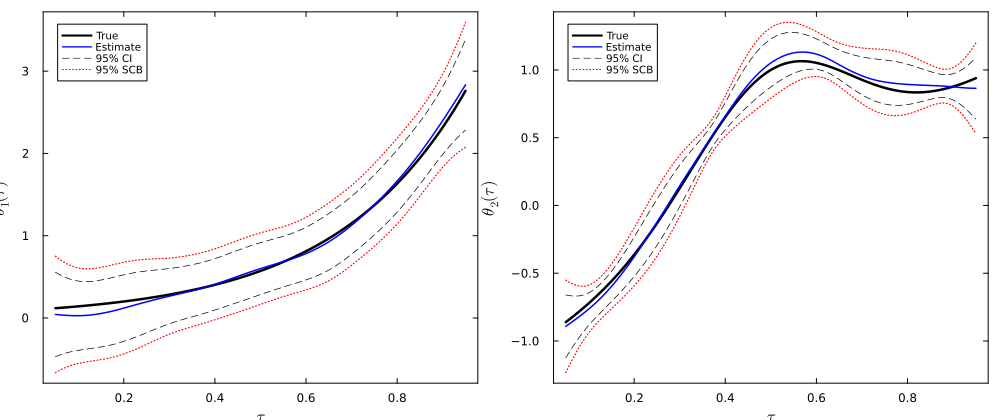

<div align="center">

# TVPSobolev.jl

**Penalised smooth minimum-distance estimators for functional coefficient regression under endogeneity.**

[](https://github.com/FarhadShahryarpoor/TVPSobolev.jl/actions/workflows/CI.yml?query=branch%3Amain)
[](https://FarhadShahryarpoor.github.io/TVPSobolev.jl/dev/)
[](LICENSE)

<br/>



<sub><b>Intercept θ₁(τ) and slope θ₂(τ)</b>, LZH design, <i>T = 800</i>.
<code>—</code> truth · <code>—</code> estimate · <code>- -</code> 95% pointwise CI · <code>···</code> 95% simultaneous band.</sub>

</div>

---

## What it does

Estimates the functional coefficient model

$$
y_t \;=\; X_t^{\top}\, \theta(t/T) \;+\; u_t, \qquad t = 1, \dots, T,
$$

where

- $y_t \in \mathbb{R}$ is the scalar outcome at time $t$;
- $X_t \in \mathbb{R}^{p}$ is the regressor vector, of which up to $s \le p$ components may be endogenous;
- $\theta : [0,1] \to \mathbb{R}^{p}$ is the unknown vector of functional coefficients, evaluated at rescaled time $\tau = t/T \in [0,1]$;
- $u_t$ is the structural error, satisfying $\mathbb{E}[u_t \mid Z_t] = 0$;
- $Z_t \in \mathbb{R}^{q}$ collects the instruments, with $q \ge s$.

Two estimators are provided: a first-order Sobolev estimator (natural linear spline) and a natural cubic spline. Both use the Gao and Tsay bias correction and a multiplier-bootstrap simultaneous confidence band.

Written for ECON 622 at UBC. Paper: [`project_report_622.pdf`](project_report_622.pdf).

## Install

```julia
using Pkg
Pkg.add(url = "https://github.com/FarhadShahryarpoor/TVPSobolev.jl")
```

Requires Julia ≥ 1.10. Depends on the standard library only.

## Quick start

```julia
using TVPSobolev, Random

data  = generate_lzh(500; rng = MersenneTwister(0))
K_F   = build_fsmd_kernel(data.Z)
K_ncs = ncs_penalty(500)

cv  = select_lambda_loocv(data.y, data.X, exp.(range(-12, 2, length = 60));
                          method = :ncs, K_F = K_F, K_ncs = K_ncs)
θ̂   = ncs_estimate(data.y, data.X, K_F, K_ncs, cv.λ)
θ̂_c = bias_correct(θ̂, data.X, cv.λ;
                    method = :ncs, K_F = K_F, K_ncs = K_ncs)
pw  = pointwise_se(data.y, data.X, θ̂_c, cv.λ;
                    method = :ncs, K_F = K_F, K_ncs = K_ncs)
scb = bootstrap_scb(data.y, data.X, θ̂_c, pw.σ_V, pw.W, pw.u_c;
                     n_boot = 1000, rng = MersenneTwister(7))
```

Full API in the [documentation](https://FarhadShahryarpoor.github.io/TVPSobolev.jl/dev/).

## Reproducing the paper

| # | Step             | Command                                                         | Runtime |
|---|------------------|-----------------------------------------------------------------|---------|
| 1 | Instantiate env  | `julia --project=scripts -e 'using Pkg; Pkg.instantiate()'`     | once    |
| 2 | Monte Carlo      | `julia --project=scripts --threads=4 scripts/run_mc.jl`         | ~2 h    |
| 3 | NKPC application | `julia --project=scripts --threads=4 scripts/run_nkpc.jl`       | ~2 min  |
| 4 | Figures          | `julia --project=scripts --threads=4 scripts/make_figures.jl`   | ~30 s   |
| 5 | Compile paper    | `latexmk -pdf project_report_622.tex`                           | ~30 s   |

Steps 3 and 4 must run before step 5. Parameters live in
`scripts/config.yaml`; seeds are fixed.

## Citation

<details>
<summary>BibTeX</summary>

```bibtex
@misc{TVPSobolev.jl,
  author  = {Farhad Shahryarpoor},
  title   = {{TVPSobolev.jl}: Sobolev-penalised smooth minimum distance estimators for functional coefficient models},
  year    = {2026},
  version = {0.1.0},
  url     = {https://github.com/FarhadShahryarpoor/TVPSobolev.jl}
}
```

</details>

## License

[MIT](LICENSE) © 2026 Farhad Shahryarpoor.
